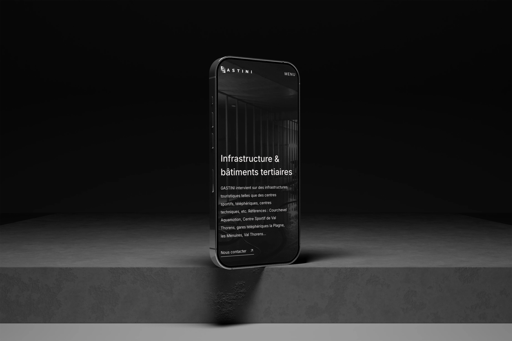

Depuis 1946, Gastini, une entreprise savoyarde, se montre résiliente face aux mutations successives des stations de ski et s'adapte pour toujours être un acteur majeur des chantiers et gros œuvres en montagne.

L'entreprise réalise des chantiers pour des entreprises luxueuses et apporte son expertise pour des chantiers de résidences, hôtels, chalets, d'infrastructures en haute montagne, mais également pour de l'éco-conception.

Entreprise de renom, Gastini nous contacte pour développer un site vitrine mettant en avant ses expertises et les différentes réalisations effectuées au cours des années. Leur volonté : un site vitrine simple et sobre, qui reflète les codes du luxe.

## Objectifs du projet

- Création de maquettes entièrement personnalisées
- Intégration des maquettes sur un site WordPress administrable par le client
- Ajout d'animations JavaScript subtiles pour renforcer l'image luxe du site web
- Sécurisation du site web
- Optimisation de la vitesse de chargement du site WordPress

